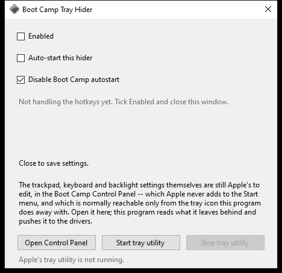

# Boot Camp Tray Hider

Get rid of Apple's Boot Camp tray utility/icon on a Windows MacBook with a background program
that has no tray icon and no window of its own.



Based on Claude's reverse-engineering of Bootcamp. Successfully emulates two key jobs of Apple's tray utility:

* init drivers with settings
* hotkey handling

All to avoid a gray square you didn't ask for (but need).

## Using it

Run `bin\HideBootcampTrayUtility.exe`, pick your settings.

- **Enabled** — take over from Boot Camp. Works its magic in the background after the window closes. Unticked, the
  program exits when you close it.
- **Auto-start this hider** — add it to Task Manager's Startup tab.
- **Disable Boot Camp autostart** — not have Apple's tray utility auto-launch.

Settings are saved when you close the window.

Three buttons below them, for Apple's own programs. These act when pressed — they are not
settings, so there is nothing to save:

- **Open Control Panel** — the Boot Camp Control Panel, which is where you actually set the
  trackpad, keyboard and backlight settings this program then pushes to the drivers. Apple
  puts no Start menu entry on it and no `.cpl`: the only door it ships is the tray icon's
  right-click menu, and this program's whole job is getting rid of that icon. Windows asks
  for administrator approval, because Apple's manifest does.
- **Start tray utility** — puts Apple's `Bootcamp.exe` back, if you want it back.
- **Stop tray utility** — ends it. Apple gives it no exit command, no close, no quit, so
  this is the only way out short of Task Manager.

## Building

```
build.cmd
```

Be amazed as it builds without downloading half the Internet, as it's C#5!

## Clause the hacker's writeup that you can skip like humans normally do

Recovered from `Bootcamp.exe` with x64dbg, driving its `headless.exe` from a script with
non-breaking logging breakpoints on `DeviceIoControl`, `CreateFileW` and
`RegQueryValueExW`. A registry, service and PnP snapshot taken either side of that run came
back identical, so what follows really is the whole difference the tray utility makes.

Apple's binary probes a dozen device names to cover every Mac it ships on. Four exist on a
MacBookAir6,1, and everything below goes through them: `\\.\AppleTrackpad`,
`\\.\AppleKeyboard`, `\\.\KeyManager` and `\\.\MacHALDriver`. None of the four needs
elevation.

### The settings pushed at logon (`DriverInit`)

| Device | IOCTL | Sent |
| --- | --- | --- |
| `\\.\AppleTrackpad` | `0x000F2004` `IOCTL_TRACKPAD_SET_MODE` | `HKCU\...\Apple Inc.\Trackpad\Mode`, as a DWORD |
| `\\.\AppleKeyboard` | `0xB403201C` `IOCTL_KEYBOARD_SET_OSX_FN_BEHAVIOR` | `OSXFnBehavior`, as a DWORD |
| `\\.\MacHALDriver` | `0x9C402484` | nothing; 60 bytes back, used only as "did that work" |
| `\\.\AppleKeyboard` | `0xB4032048` `IOCTL_ACPI_BRIGHTNESS_AVAILABLE` | `1` |

The IOCTL names are Apple's own, lifted from the error strings in the binary. That last row
is what gives F1 and F2 back; the first is tap to click, secondary tap and scrolling, all
three of which live in the one `Mode` word.

These are re-sent whenever a HID device arrives or the machine wakes, because a driver that
has just been reloaded knows none of it. `Bootcamp.exe` watches for the same two things —
it imports `RegisterDeviceNotification` and `RegisterPowerSettingNotification`, and still
carries the symbol `CMainFrame::OnPowerBroadcast`.

### The hotkeys (`HotkeyWorker`)

Hotkeys arrive as an inverted-call notification. `\\.\KeyManager` is opened and handed one
auto-reset event per hotkey, passed as the raw `Type3InputBuffer` with `nInBufferSize = 0`
(`METHOD_NEITHER`). The driver signals the matching event on a keypress; a background
thread sits in `WaitForMultipleObjects`. Boot Camp registers twenty-nine of these; the five
above are the ones with nothing else behind them. The volume keys are then passed straight
to Windows as `VK_VOLUME_*` presses, which is what raises the familiar volume overlay.

### The backlight (`Backlight`, `BacklightIdle`)

The keyboard backlight is the Apple SMC key `LKSB`, written through `\\.\MacHALDriver` with
IOCTL `0x9C402458` and an input buffer of `"LKSB\0"` + big-endian `level << 4`. The
hardware level is 0..4095; Boot Camp's user-facing scale is 0..16 and maps as `level << 8`.
The level is tracked in memory and persisted to the same registry value Boot Camp uses,
`HKCU\Software\Apple Inc.\Apple Keyboard Support\Light Value`.

Boot Camp can also *read* the key — IOCTL `0x9C402460`, `"LKSB\0"` in and twelve bytes out
— so an earlier note in this project that `LKSB` is write-only was wrong. Those twelve
bytes are not decoded here, so the stored level is still what this program trusts.

`User Absence` in the same registry key is the "turn off keyboard backlight when computer
is not used for" slider, in milliseconds. `Bootcamp.exe` imports `GetLastInputInfo` and
`SetTimer` and installs no input hook, so it polls; so does this. The fade deliberately
does not write `Light Value` — that is the level the user chose, not the level the room is
in — so the light comes back where they left it.

### Reaching the control panel (`BootCamp`)

Two Apple binaries, not one:

| Binary | Manifest | What it is |
| --- | --- | --- |
| `C:\Program Files\Boot Camp\Bootcamp.exe` | `asInvoker` | the tray utility; `HKLM\...\Run\Apple_KbdMgr` starts it, unquoted path and all |
| `C:\Windows\System32\AppleControlPanel.exe` | `highestAvailable` | the settings UI; imports no `Shell_NotifyIcon`, so it really does just close |

Starting the control panel took two goes to get right, and both failures are worth writing
down.

MSBuild compiles an `AnyCPU` executable as `Prefer32Bit` unless told otherwise, so this
program runs under WOW64 and every path it asks for in `System32` is answered from
`SysWOW64` — where Apple installs nothing. The build is left 32-bit deliberately: the
driver IOCTL buffers were proven at that width.

The documented way out is the `Sysnative` alias, and it half works. `File.Exists` on
`C:\Windows\Sysnative\AppleControlPanel.exe` is true, and `CreateProcess` on it fails with
`ERROR_ELEVATION_REQUIRED` (740) — which proves the path resolved. But `ShellExecute`, the
one call that *can* elevate, comes back with `ERROR_PATH_NOT_FOUND` (3): a `highestAvailable`
program is started for you by the elevation service, that service is a different process,
and `Sysnative` is an alias only the calling process has.

So the launch has to name the real `C:\Windows\System32` path and switch the redirector off
around it with `Wow64DisableWow64FsRedirection`. That scope is kept to the one call — while
it is open, a 32-bit process loading a DLL by name out of `System32` would get the 64-bit
copy and fail.

### What is not implemented: "Adjust in Low Light"

The ambient-light checkbox on the same control panel tab is left alone, and the evidence
says that is probably the right place for it:

- `"Adjust in Low Light"` appears in `Bootcamp.exe` only as a registry value name.
- The binary contains exactly one SMC key literal, `LKSB`. No ambient-light key
  (`ALV0`, `ALV1`, `MSAL`, `ALSF`, …) is anywhere in it.
- Its only WMI use is `ROOT\CIMV2`, with no light-sensor query.

So the light is almost certainly not being read in user mode at all: the flag is handed to
a driver and the firmware follows the sensor itself. Settling which of the keyboard IOCTLs
carries it would mean disassembling `KeyMagic.sys`.

## What it writes

| Where | What |
| --- | --- |
| `HKCU\Software\HideBootcampTrayUtility` | `Enabled` |
| `HKCU\...\CurrentVersion\Run` | `HideBootcampTrayUtility`, when auto-start is on |
| `HKCU\...\Explorer\StartupApproved\Run` | the Startup-tab switch for its own entry |
| `HKLM\...\Explorer\StartupApproved\Run` | the Startup-tab switch for `Apple_KbdMgr`, elevated |
| `HKCU\Software\Apple Inc.\Apple Keyboard Support` | `Light Value`, shared with Boot Camp |

Everything else Boot Camp stores — the trackpad `Mode`, `OSXFnBehavior`, `User Absence` —
is read and never written: those belong to the Boot Camp control panel. Nothing is written
outside the registry and nothing is installed.
